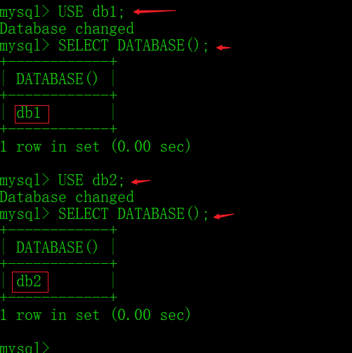

本笔记将会参考

> 视频 ： `慕课网`  [MySQL8.0零基础入门之从青铜到钻石](https://www.imooc.com/learn/1281)
>
> 文章 ：`W3school编程狮` [MySQL 入门教程](https://www.w3cschool.cn/mysql/mysql-tutorial.html)
>
> 学习路线 ：`知乎` [MySQL 学习路线是怎样的？有哪些学习资料或网站推荐？](https://www.zhihu.com/question/20931204)


[欧阳熊猫 ](https://www.imooc.com/u/6561220/courses?sort=publish) ---JAVA开发工程师

- **难度**入门

- **时长** 5小时30分J

- **学习人数**7064

- **综合评分**9.20

#   1. MySQL服务

## 1.1 DOS连接MySQL

> 本节要点 ：MySQL的的登录的`4`种方式


### 1.1.1 登录MySQL

【案例1-登录方式1】

> 最短+无显示密码

```sql
-- 格式

mysql -u用户名 -p
Enter password: 密码

-- 实例

mysql -uroot -p
Enter password: 123456
```


【案例2-登录方式2】


```sql
-- 格式

mysql -u用户名 -p密码

-- 实例

mysql -uroot -p123456
```


【案例3-登录方式3】

```sql
-- 格式 
mysql -h主机名 -u用户名 -p密码
或者
mysql -h主机IP地址 -u用户名 -p密码

-- 实例
mysql -hlocalhost -uroot -p密码
mysql -h127.0.0.1 -uroot -p123456
```

> 确保安装的mysql所在的主机，那么就可使用此格式
>
> 其中127.0.0.1是IP地址，localhost代表本地


【案例4-登录方式4】

```sql
-- 格式

mysql --host=127.0.0.1 --user=用户名 --password=密码

-- 实例

mysql --host=127.0.0.1 --user=root --password=123456
```

> 这种登录方式比较全面，语意清晰，但是作为了解


### 1.1.2 退出MySQL

1.方式1

```sql
exit
-- 实例
mysql> exit
Bye

C:Users\NY>
```


## 1.2 DBMS,数据库，之间的关系

1. DBMS : (Data Base Management System,数据库管理系统)

    - 定义：一个软件
- 描述 ：进入数据库的入口
    - 作用 ：管理数据中的数据


**DBMS，数据，表之间的关系是什么?**

1. 先有DBMS数据库管理系统

2. 再用DBMS创建数据库

3. 再用数据库建表，添加数据等

4. 一库可创多张表


**学习SQL需要学习那些东西?**

- 包括``查询``，函数

1. 基础查询
2. 条件查询
3. 排序查询
4. 常见函数
5. 分组函数
6. 分组查询
7. 连接查询
8. 子查询
9. 分页查询
10. union联合查询

> 实际上，这些都属于[DQL](https://www.geeksforgeeks.org/sql-ddl-dql-dml-dcl-tcl-commands/)部分的内容


# 2. SQL语法介绍
##  2.1 SQL概述

**Q1-SQL 是什么?**

- 定义 ：SQL (Structure  Query Language,结构化查询语言)
- 作用 ：对数据库操作(库中表，数据等)
- 描述 ： SQL是数据库管理系统都需遵循的规范，不同的数据库生产厂商都支持SQL语句，但都有特有特点


##  2.2 SQL语法分类

> 对于分类，需要注意的点

1. 对象 ：操作针对的对象是谁
2. 操作 ：对于对象有哪些操作


**一，分类**

1. DDL
    - 定义 ： (Data Definition Language,数据定义语言)
    - 作用 : 定义数据库对象(数据库，表，列等)
        - 关键字 : drop,create,alter

2. DML

    - 定义 ：(Data Manipulation Language,数据操作语言)
    - 作用 ： 对数据中的表的数据增删改操作
        - 关键字 ：insert,delete,update

3. DQL

   - 定义  : (Data Query Language,数据查询语言)

    - 作用 ：查询数据库中表的记录(数据)
    - 关键字 ： select,where 等

4. DCL(做了解)

   - 定义 ： ( Data Control  Language,数据控制语言 )

    - 作用 ：定义数据中的访问权限，安全级别，创建用户
    - 关键字 : GRANT,REVOKE


##  2.3 SQL通用语法及语法规范

> 语法是什么?规范

1.SQL语句可单行或多行，以分号 `;`结尾

2.使用适当`空格`和``缩进`增加代码可读性

3.MySQL数据库语句`不区分大小写`

> 但是关键字建议大写


```sql
SELECT * FROM student;

select * from student;

 
```

> 因为系统的执行过程会将小写转换为大写

 

# 3. SQL使用

对于SQL的语法，要围绕几个点理解

1. 有 (增)
2. 变 (改)
    - 状态的改变
3. 无 (删)


## 3.1 DDL

### 3.1.1 DDL之数据库操作

**对数据库的操作有哪些?**

- 增，删，改

#### 3.1.1.1 增

> 增即『创建』

**创建数据库的方式有哪些?**

```py
- 创建数据库方式
	- 1.直接
	- 2.判断并创建
	- 3.设置编码集并创建
```


一，直接创建

> 创建数据库`db1`

```sql
-- 格式
CREATE DATABASE 数据库名;
-- 实例
CREATE DATABASE db1;

```


> 1.如何查看数据库是否创建成功呢?
>
> ```sql
> -- 格式
> SHOW DATABAES;
> ```
>
> 
>


二，判断是否存在并创建数据库

1.创建数据库`db2`

```sql
 -- 格式
 CREATE DATABASE IF NOT EXISTS 数据库名;
 -- 实例
 CREATE DATABASE IF NOT  EXISTS  bd2;

```

 


**使用这种方式的好处有啥?**

- 避免出错 ：创建第一次后，再次执行创建命令不会出错

 

>因为这个逻辑是 ：『Q:如果这个数据库db2不存在，则请帮我创建，如果这个数据库存在呢?，就不用管啦 (我的目的是创建数据库)』
>但是用第一种方式就是 ： 『Q:帮我创建数据库db1,A:可是这个数据库不存在哎(返回报错)』
>
>==使用场景 :== 数据库的备份和还原，使用第一种，则不会还原(因为可能出错，导致中止)


2.创建数据库并设置字符集(编码表)

> 创建数据库`db3`

```sql
-- 格式
CREATE DATABASE 数据库名 CAHRACTER SET 字符集;
-- 实例
CREATE DATABASE db3 CAHRACTER SET gbk;
-- 翻译 ： 创建 数据库 xxx 字符集 为xxx
```


> 如何查看创建的数据库的结构?
>
> ```sql
> -- 格式
> SHOW CREATE DATABASE 数据库;
> 
> -- 实例
> SHOW CREATE DATABASE db3;
> ```
>
> 


> 默认的MySQL字符集编码是 `uft8mb4`
>
> 


#### 3.1.1.2  改

一，修改数据库字符集格式

```sql
-- 格式
ALTER DATABASE 数据库名 DEFAULT CAHRACTER SET 字符集;
-- 实例
ALTER DATABASE db3 DEFAULT CHARACTER SET utf8mb4;

```


> 改操作的应用场景较少


#### 3.1.1.3 删


一，删除数据库

```sql
-- 格式
DROP DATABASE 数据库名;

-- 实例
mysql> DROP DATABASE db3;
Query OK, 0 rows affected (0.19 sec) 
```


二，查看正在使用的数据库


```sql
-- 格式
SELECT DATABASE();

-- 实例
mysql> SELECT DATABASE();
+------------+
| DATABASE() |
+------------+
| db2        |
+------------+
1 row in set (0.00 sec)
```


三，使用数据库

```sql
-- 格式
USE  数据库名;

-- 实例
mysql> USE db2;
Database changed
```





### 3.1.2 DDL之表操作


####  3.1.2.1 表

> 表要在创建数据库`前提下`使用


**一，表有哪些组成?**

1. 行
2. 列
3. 字段

编号 |姓名 | 年龄 |性别
----:|----:|----:|----:
1|zhangSan|19|男
2|liSi|17|女
3|wangWu|18|男


**二，如何创建表？**


##### 3.1.2.1.1 增

```sql
-- 格式
CREATE TABLE 表名 (字段名1 字段类型1 ,字段名2 字段类型2,…);

-- 实例

mysql> CREATE TABLE student(id int,name varchar(10),age int,sex char(1));
Query OK, 0 rows affected (0.07 sec)

-- 虽然命令行输入的是一整行，但是建议使用如下格式
mysql> CREATE TABLE student(
    id int,
    name varchar(10),
    age int,
    sex char(1)
);
Query OK, 0 rows affected (0.07 sec)
-- 这样代码可读性高 readability
```

> 创建表肯定需要插入数据

**一，QL中的数据类型有哪些?**

:arrow_forward: 常用数据类型

类型 |说明
----|----
int | 整型
double | 浮点型
varchar | 字符串型
date | 日期类型 :`yyy-MM-dd`


> 查看是否创建成功，此时仅是定义表的结构，没有插入数据
>
> ```sql
> -- 语法
> SHOW TABLES  --注意是TABLES 展示所有数据库中的表
> -- 实例
> mysql> SHOW TABLES;
> +---------------+
> | Tables_in_db2 |
> +---------------+
> | student       |
> +---------------+
> 1 row in set (0.01 sec)
> ```
>
> > 发现已经有 student表了


(1)，查看表结构

```sql
-- 语法
DESC 表名;
-- 实例
mysql> DESC student;
+-------+-------------+------+-----+---------+-------+
| Field | Type        | Null | Key | Default | Extra |
+-------+-------------+------+-----+---------+-------+
| id    | int         | YES  |     | NULL    |       |
| name  | varchar(10) | YES  |     | NULL    |       |
| age   | int         | YES  |     | NULL    |       |
| sex   | char(1)     | YES  |     | NULL    |       |
+-------+-------------+------+-----+---------+-------+
4 rows in set (0.04 sec)
```

> int 类型默认是`11`位

`int == int(11)`


(2)，查看表信息

```sql
-- 语法
SHOW CREATE TABLE 表名;
-- 实例


mysql> SHOW CREATE TABLE student;
+---------+----------------------------------------------------------
| Table   | Create Table                                             
+---------+----------------------------------------------------------
| student | CREATE TABLE `student` (
  `id` int DEFAULT NULL,
  `name` varchar(10) DEFAULT NULL,
  `age` int DEFAULT NULL,
  `sex` char(1) DEFAULT NULL
) ENGINE=InnoDB DEFAULT CHARSET=utf8mb4 COLLATE=utf8mb4_0900_ai_ci |
+---------+----------------------------------------------------------
1 row in set (0.01 sec)
```

> 这里有`CHARSET=utfmb4`编码集信息，还有`ENGINE=InnoDB`引擎信息

:warning: 使用小技巧

**Q4-如何快速的创建与其他表一模一样的表结构?**

```sql
-- 语法
CREATE TABLE  新表名 LIKE 旧表名;
-- 实例
mysql> CREATE TABLE student1 LIKE student;
Query OK, 0 rows affected (0.11 sec)
```

> 1.查看所有表
>
> ```sql
> mysql> SHOW TABLES;
> +---------------+
> | Tables_in_db2 |
> +---------------+
> | student       |
> | student1      |
> +---------------+
> 2 rows in set (0.01 sec)
> ```
>
> 2.查看表结构
>
> ```sql
> mysql> DESC student1;
> +-------+-------------+------+-----+---------+-------+
> | Field | Type        | Null | Key | Default | Extra |
> +-------+-------------+------+-----+---------+-------+
> | id    | int         | YES  |     | NULL    |       |
> | name  | varchar(10) | YES  |     | NULL    |       |
> | age   | int         | YES  |     | NULL    |       |
> | sex   | char(1)     | YES  |     | NULL    |       |
> +-------+-------------+------+-----+---------+-------+
> 4 rows in set (0.01 sec)
> ```
>
> > 实际上会发现，`student1`和`student`表示一模一样的，使用`LIKE`关键字
> >
> > 含义 ： "创建一个表 a LIKE(像) b"
>
> 3.删除表
>
> ```sql
> mysql> DROP TABLE student1;
> Query OK, 0 rows affected (0.06 sec)
> 
> -- 查看表结构，提示不存在，说明已经删除
> mysql> DESC student1;
> ERROR 1146 (42S02): Table 'db2.student1' doesn't exist
> ```
>
> 

##### 3.1.2.1.2  删

删除表方式

1. .直接删

2. 判断后删除


一，直接删

```sql
-- 语法
DROP TABLE 表名;
-- 实例

mysql> DROP TABLE s1;
Query OK, 0 rows affected (0.05 sec)
```

二，判断后删

```sql
-- 语法
DROP TABLE  EXISTS 表名 ;
-- 实例

mysql> DROP TABLE IF EXISTS student1;
Query OK, 0 rows affected, 1 warning (0.01 sec)
```

> 使用判断的好处和`CREATE DATABASE`类型，再次执行则不会报错


##### 3.1.2.1.2 改

```sql
-- 1.添加表列
-- 格式
ALTER TABLE 表名 ADD 列名 类型;
-- 实例

mysql> ALTER TABLE student ADD remark int ;   -- 修改表
Query OK, 0 rows affected (0.09 sec)
Records: 0  Duplicates: 0  Warnings: 0

mysql> DESC student;   -- 查看表结构
+--------+-------------+------+-----+---------+-------+
| Field  | Type        | Null | Key | Default | Extra |
+--------+-------------+------+-----+---------+-------+
| id     | int         | YES  |     | NULL    |       |
| name   | varchar(10) | YES  |     | NULL    |       |
| age    | int         | YES  |     | NULL    |       |
| sex    | char(1)     | YES  |     | NULL    |       |
| remark | int         | YES  |     | NULL    |       |
+--------+-------------+------+-----+---------+-------+
5 rows in set (0.00 sec)
```

**一，修改的内容有哪些?**

1. 字段(列)类型
2. 列名
3. 表名

【案例1-修改字段类型】


```sql
-- 语法
 ALTER  TABLE  表名  MODIFY  列名  类型;
-- 实例


mysql> ALTER TABLE student MODIFY remark varchar(20); -- 修改列类型
Query OK, 0 rows affected (0.15 sec)
Records: 0  Duplicates: 0  Warnings: 0

mysql> DESC student; -- 查看表结构
+--------+-------------+------+-----+---------+-------+
| Field  | Type        | Null | Key | Default | Extra |
+--------+-------------+------+-----+---------+-------+
| id         | int               | YES  |     | NULL    |       |
| name   | varchar(10) | YES  |     | NULL    |       |
| age      | int               | YES  |     | NULL    |       |
| sex       | char(1)        | YES  |     | NULL    |       |
| remark | varchar(20) | YES  |     | NULL    |       |
+--------+-------------+------+-----+---------+-------+
5 rows in set (0.00 sec)
```

【案例2-修改列名】

```sql
-- 语法
ALTER TABLE 表名 CHANGE 旧列名 新列名 类型;
-- 实例

mysql> ALTER TABLE student CHANGE remark intro varchar(20); -- 改列名
Query OK, 0 rows affected (0.04 sec)
Records: 0  Duplicates: 0  Warnings: 0

mysql> DESC student;  -- 查看表结构
+-------+-------------+------+-----+---------+-------+
| Field | Type        | Null | Key | Default | Extra |
+-------+-------------+------+-----+---------+-------+
| id    | int         | YES  |     | NULL    |       |
| name  | varchar(10) | YES  |     | NULL    |       |
| age   | int         | YES  |     | NULL    |       |
| sex   | char(1)     | YES  |     | NULL    |       |
| intro | varchar(20) | YES  |     | NULL    |       |
+-------+-------------+------+-----+---------+-------+
5 rows in set (0.01 sec)
```

【案例3-删除列】

> 注意 ：这里的删除列，实际上也是一种对于表的修改
>
> 这个删除是对于表的`内容的修改`，而不是对表的整体的删除!!!

```sql
-- 语法
ALTER TABLE 表名 DROP 字段;
-- 实例


mysql> ALTER TABLE student DROP intro;  -- 删除列
Query OK, 0 rows affected (0.15 sec)
Records: 0  Duplicates: 0  Warnings: 0

mysql> DESC student;      -- 查看表结构
+-------+-------------+------+-----+---------+-------+
| Field | Type        | Null | Key | Default | Extra |
+-------+-------------+------+-----+---------+-------+
| id        | int               | YES  |     | NULL    |       |
| name  | varchar(10) | YES  |     | NULL    |       |
| age     |   int             | YES  |     | NULL    |       |
| sex      | char(1)        | YES  |     | NULL    |       |
+-------+-------------+------+-----+---------+-------+
4 rows in set (0.01 sec)
```

【案例-修改表名】


```sql
-- 格式
 RENAME TABLE 旧表名 to 新表名;
-- 实例

mysql> RENAME TABLE student to studentNew;  -- 修改表名
Query OK, 0 rows affected (0.05 sec)
mysql> SHOW TABLES;  -- 查看所有表检验
+---------------+
| Tables_in_db2 |
+---------------+
| s1            |
| studentnew    |
+---------------+
2 rows in set (0.00 sec)
```

:point_right: 修改字符集

```sql
-- 语法
ALTER TABLE 表名 CHARACTER SET 字符集;
-- 实例

mysql> ALTER TABLE studentNew CHARACTER SET gbk; -- 改为gbk
Query OK, 0 rows affected (0.03 sec)
Records: 0  Duplicates: 0  Warnings: 0

mysql> SHOW CREATE TABLE studentNew;  -- 查看表信息
+------------+-------------------------------------------------------
| Table      | Create Table                                           
+------------+------------------------------------------------------+
| studentNew | CREATE TABLE `studentnew` (
  `id` int DEFAULT NULL,
  `name` varchar(10) CHARACTER SET utf8mb4 COLLATE utf8mb4_0900_ai_ci DEFAULT NULL,
  `age` int DEFAULT NULL,
  `sex` char(1) CHARACTER SET utf8mb4 COLLATE utf8mb4_0900_ai_ci DEFAULT NULL
) ENGINE=InnoDB DEFAULT CHARSET=gbk |
+------------+------------------------------------------------------+
1 row in set (0.00 sec)
```


小结 ： 


### 3.1.3  DDL之数据操作

#### 3.1.3.1 增

> 往表中添加数据，称为`插入记录`，一个添加操作就是一条`记录`

**一，注意事项有哪些?**

1. 值与字段必须对应，个数同，类型同

2. 整数，数值不加`' '`号，字符需加`' '`

3. 不想设置字段值，则为`NULL`

    

**二，插入数据的方式有哪些?**

1. 插入全部字段
2. 插入部分指定字段


> 插入记录的前提是 ：①创建了数据库，②创建了表

一般格式

```sql
-- 语法
INSERT INTO 表名(列名1,列名2,列名3，...) values(值1,,值2,值3,...)；
-- 实例
INSERT INTO student(id,name,sex,age)values(1,'zhangSan','男',19)；
```

> 以下操作基于`db2`库，`student`表
>
> ```sql
> -- 创数据库
> CREATE DATABASE IF NOT EXISTS db2;
> -- 创表结构
> CREATE TABLE student(
>     id int,
>     name varchar(20),
>     sex char(1),
>     age int
> );
> ```
>
> 


**方式1.插入全部记录(字段)**

```sql
-- 语法
INSERT INTO 表名 values(值1，值2，值3，…)
-- 实例

mysql> INSERT INTO student values(0001,'zhangSan','男',19);
Query OK, 1 row affected (0.02 sec)
```

> 查看表数据信息
>
> ```sql
> mysql> SELECT * from student;
> +------+----------+------+------+
> | id   | name        | sex  | age  |
> +------+----------+------+------+
> |   1  | zhangSan | 男    |   19  | 
> +------+----------+------+------+
> 1 row in set (0.01 sec)
> ```
>
> > 发现已有`4`条数据

> 注意 ：插入全部记录，需保证，字段和值对应，且要写全

**方式2.插入部分字段**

```sql
-- 格式
INSERT INTO 表名(字段x,字段y,字段z)values(值x,值y,值z);
-- 实例
mysql> INSERT INTO student(id,sex,age)values(2,'女',20);   -- 插入部分值
Query OK, 1 row affected (0.01 sec)

mysql> SELECT * from student;         -- 查询所有字段
+------+----------+------+------+
| id   | name     | sex  | age  |
+------+----------+------+------+
|    1 | zhangSan | 男   |   19 |
|    2 | NULL        | 女   |   20 |
+------+----------+------+------+
2 rows in set (0.00 sec)
```

> 同样，插入部分，字段和值要对应，没有值的字段默认为`NULL`,注意是空值，而不是字符串NULL
>
> 如果4选3，但是3中有一个想不写，则可这样
>
> ```sql
> mysql> INSERT INTO student(id ,name,age)values(3,'wangWu',NULL);
> Query OK, 1 row affected (0.01 sec)
> 
> mysql> SELECT * from student;
> +------+----------+------+------+
> | id   | name     | sex  | age  |
> +------+----------+------+------+
> |    1 | zhangSan  | 男       |    19   |
> |    2 | NULL         | 女       |   20    |
> |    3 | wangWu   | NULL  | NULL  |
> +------+----------+------+------+
> 3 rows in set (0.00 sec)
> ```
>
> > 这样age对应的值为`NULL`,同样不能写为`'NULL'`字符串形式，不能加引号，这样就是一个字符，是个实体

#### 3.1.3.2 蠕虫复制

**一，蠕虫复制是什么?有什么用?**

- 在已有数据基础上，将原来的数据复制，插入到对应表中
- 可以复制表的数据字段到另一个表，而不是结构

**二， 蠕虫复制怎样使用?**

```sql
-- 语法
INSERT INTO 被插入数据的表1 SELECT  * FROM 表2
-- 实例
INSERT INTO student SELECT * FROM student;
```

【案例1-复制全部数据】

(1).创建student2表，student2表结构和student表结构一样

```sql
mysql> CREATE TABLE student2 LIKE student;
Query OK, 0 rows affected (0.07 sec)
```

(2).将student表中数据插入到student2表中

```sql
mysql> INSERT INTO student2 SELECT * FROM student;
Query OK, 3 rows affected (0.02 sec)
Records: 3  Duplicates: 0  Warnings: 0
```

(3).查看student2表中的数据

```sql
mysql> SELECT * FROM student2;
+------+----------+------+------+
| id   | name     | sex  | age  |
+------+----------+------+------+
|    1 | zhangSan | 男   |   19 |
|    2 | NULL     | 女   |   20 |
|    3 | wangWu   | NULL | NULL |
+------+----------+------+------+
3 rows in set (0.00 sec)

```

> 就会发现，student2中数据和student中数据一样

【案例2-复制指定部分数据】

(1).将student中`name`,`age`字段复制到student2中

```sql
mysql> INSERT INTO student2(name,age) SELECT name,age FROM student;
Query OK, 3 rows affected (0.01 sec)
Records: 3  Duplicates: 0  Warnings: 0
```

> 其实就是将查询的结果追加到表中
>
> 效果
>
> 
>
> 因为 sex没有指定，所以追加后的值为NULL空值


## 3.2 DML

